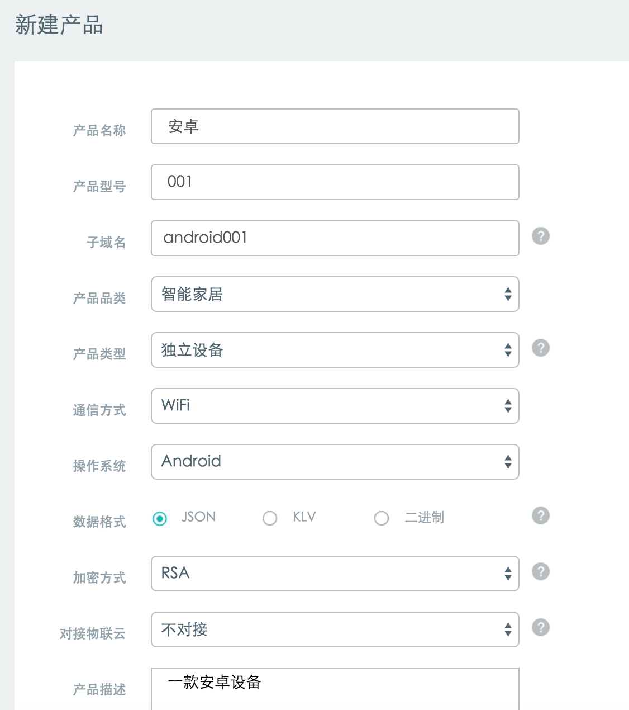
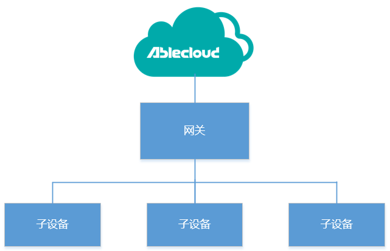

#安卓设备开发指导

安卓设备指的是操作系统为安卓的设备，一般带有用户交互界面，连接网络的形式为WiFi、以太网或者GPRS。配置设备连接网络通过交互界面直接进行。给用户提供服务的为安卓系统上运行的APP。设备可以是独立设备也可以是一个网关，一般很少作为网关的子设备。AbleCloud提供开发该APP所需要的SDK，该SDK可用于开发安卓独立设备和安卓网关。SDK重继承了设备和客户端绑定、设备向云端上报消息，设备接收云端消息、设备OTA、设备定时任务、文件存储、局域网通信等功能。

#开发准备
##管理控制台
###新建产品
首先需要在管理控制台创建产品，产品操作系统选择安卓。对于安卓设备，云端和设备的数据交互我们建议采用JSON格式。通信方式根据具体情况填写。一个典型的填写表单如下图所示：



###定义功能点
在设备功能开发前，需要在开发管理控制台定义设备端的数据点和数据包。其中数据点对应设备上的功能点，数据包是设备和云端数据交互的数据单元，一个数据包中包括一个或者多个数据点。

需要单独说明的是，从云端像设备发送的消息的数据包的message code的范围是65~199；设备向云端上报的消息的message code的范围是200~255。


##软件开发配置
####SDK发布库
AbleCloud发布的安卓设备SDK为`ac_device_android.jar`，除此之外，还需要导入`libDevice-Service.so`文件（可根据不同cpu做不同选择）

>**具体步骤**:把文件拷入你自己的工程的libs目录下并设置依赖。
 
####开发环境设置
以下为 AbleCloud Android SDK 需要的所有的权限，请在你的AndroidManifest.xml文件里的`<manifest>`标签里添加
```java
<uses-permission android:name="android.permission.INTERNET"/>
<uses-permission android:name="android.permission.ACCESS_WIFI_STATE"/>
<uses-permission android:name="android.permission.ACCESS_NETWORK_STATE" />
<uses-permission android:name="android.permission.CHANGE_WIFI_STATE" />
<uses-permission android:name="android.permission.CHANGE_NETWORK_STATE"/>
```

####应用程序初始化
在你的应用使用AbleCloud服务之前，你需要在代码中对AbleCloud SDK进行初始化。

> 具体步骤:在启动App的`MainActivity`的`onCreate()`方法中调用此方法来进行初始化。

开发阶段，请初始化测试环境
```java
/**
     * 请在主Activity的onCreate()中初始化安卓设备信息并开始连云操作
     *
     * @param mContext         获取Context实例
     * @param MajorDomainId    AbleCloud domainId，可到AbleCloud管理控制台查看
     * @param SubDomainId      AbleCloud subDomainId，可到AbleCloud管理控制台查看
     * @param physicalDeviceId AbleCloud设备物理ID，长度为16个字节，厂商需自己保证唯一性
     * @param secretKey        AbleCloud设备密钥，在产品管理中-->管理-->设备密钥，若使用AbleCloud默认分配的密钥对，则填写默认密钥里的私钥，如选择设备独立密钥入库，则需要使用密钥生成工具自己生成公私钥并把上传文件
     * @param version          AbleCloud设备版本，格式为"1-0-0";在初始化一个OTA版本后，若需要进行OTA升级，需要在设备管理中--         >OTA-->新建OTA版本把新的apk文件上传
     * @param mode             AC.TEST_MODE,当迁移到正式环境后使用AC.PRODUCTION_MODE，默认使用AC.PRODUCTION_MODE
     * @param regional         AbleCloud地域设置，AC.REGIONAL_CHINA代表中国地域，AC.REGIONAL_SOUTHEAST_ASIA代表东南亚地域，默认使用中国地域
     */
AC.init(Context Context, long MajorDomainId, long SubDomainId, String PhysicalDeviceId, String SecretKey, String Version, int Mode, int Regional);
```
**国内地域**
测试环境
```java
AC.init(this, MajorDomainId, SubDomainId, SecretKey, Version, AC.TEST_MODE);
```
在完成测试阶段之后，需要迁移到正式环境下。
```java
AC.init(this, MajorDomainId, SubDomainId, SecretKey, Version);
```
**国外地域**
```java
AC.init(this, MajorDomainId, SubDomainId, SecretKey, Version, AC.TEST_MODE, AC.REGIONAL_SOUTHEAST_ASIA);
```
在完成测试阶段之后，需要迁移到正式环境下。
```java
AC.init(this, MajorDomainId, SubDomainId, SecretKey, Version, AC.PRODUCTION_MODE, AC.REGIONAL_CHINA);
```
><font color=red>注</font>：初始化操作时厂商需要为每个设备分配一个**16字节长度的物理ID**，并保证该ID的唯一性。在厂商没有自己唯一的设备标识号情况下，建议使用**WIFI MAC地址**或者**手机IMEI号**并补0或其他将长度拼至16字节；可通过AbleCloud的管理控制台查看**在线设备**查看设备物理ID。

#安卓独立设备
##设备和客户端绑定
###说明
一般安卓设备均带有用户交互界面，建议绑定采取APP扫码形式进行。设备屏幕显示二维码，使用客户端APP扫描二维码进行绑定。

建议安卓设备在首次连接到云端握手成功后，屏幕显示由设备subdomain+物理生成的二维码。然后使用APP扫描该二维码进行解析，调用bindDevice接口绑定设备。第一个绑定的用户成为该设备管理员，之后的用户再次使用该二维码绑定时会绑定失败。因此之后的用户需要从管理员那里扫描管理员分享的二维码进行设备绑定。

？？需要增加绑定模式，之后绑定的人再次扫描二维码绑定的时候给管理员发送推送，等待管理员同意后绑定成功。


设备端有强制解绑接口，设备可以调用该接口将设备的所有用户强制全部解绑。强制解绑后再次绑定时，第一个绑定的人成为设备管理员。同时，强制解绑再次绑定后，设备会被分配新的逻辑ID，设备之前产生的所有历史数据记录在之前的逻辑ID上，使用新的逻辑ID无法查看。

###开发示例
####绑定设备

####分享设备


相关接口请参考：


##接收云端消息
###说明
安卓设备的SDK集成了和云端的长连接。设备的功能APP无论在前台还是后台运行都可以收到云端发送的消息。因此，开发者对云端消息接口进行实现即可。

为了更好的体验，我们建议消息处理接口中，设备将云端指令执行完成后将最新的设备状态作为响应信息返回云端。

###开发示例
？？


##向云端上报消息
###说明
设备可以在定时或者根据外界条件触发的情况下将设备数据和状态主动上报到云端。其中上报的消息号(message code)必须大于等于200。

###开发示例


##实时消息同步
###说明
实时消息同步指的是APP和设备之间消息和状态的实时同步。比如在APP打开时，设备上的开关发生变化，APP页面上的设备开关状态显示跟着实时变化而不需要进行刷新操作。

消息可以在APP和APP、APP和设备之间实时同步。
AbleCloud的实时消息同步基于存储实现，因此对于需要进行实时消息同步的功能点需要在控制台创建相应的存储。数据源（一般是设备）向该数据集写入数据，然后需要进行实时消息同步的客户端订阅该存储的列。

###开发示例


##OTA
###说明
安卓设备OTA主要用于对安卓设备上的功能APP进行升级。
进行OTA需要以下几个步骤：
1、开发者在管理控制台发布新的OTA版本。如下图所示
？？缺少控制台的配置说明信息。
2、安卓设备以轮询的方式向云端检查升级。云端发布OTA后，设备会检查到有新的升级信息。
3、设备根据升级信息里的下载链接去下载OTA文件并完成校验。下载完成后通知云端OTA文件下载完成。
4、设备自己控制新的功能的安装，安装完成后通知云端新的版本安装完成。

流程图如下图所示：
？？缺少一个OTA的交互流程图。

###开发示例
1、网关向云端检查升级，网关确认升级


2、APP向云端检查升级，APP确认升级

##定时任务
###说明
定时任务分为云端定时和设备端定时。

云端定时指的是APP或者设备将定时任务信息发送到云端，云端记下来任务触发的时间。在到达触发时间后，云端将控制指令发送给设备。云端定时要求在任务触发时设备一定是在线的，否则执行失败。使用云端定时，只适用于长连接的设备。

设备端定时指的是定时任务存储在设备上。既可以通过APP进行任务设定时，此时云端将定时信息和任务信息转发给设备；也可以通过设备直接进行任务定时，设备将任务信息上报给云端。由于安卓设备连接网络后可以和网络时间进行同步，所以基本能保证定时任务触发时间的准确性；由于具体的任务时间和任务动作都是存储在设备上，设备断网之后任务也可以执行。对于使用短连接的设备，定时任务的设定不能够通过APP进行。

？？1、安卓设备是否做了设备端定时功能？若是短连接的安卓设备，只能够设备定时。


###开发示例


##文件存储
###说明
文件存储是AbleCloud提供的非结构化存储功能。可以用来存储头像、文件等大的数据块。单个文件最大支持4G。


###开发示例


##局域网通信
###说明
局域网通信是指设备和设备、APP和设备在一个局域网内时，不通过云端直接进行通信。

局域网通信能够保证在外网异常断开情景下的的设备的正常使用。同时在局域网环境时提供设备之间的高速访问能力及关联控制功能。

建议在云端和局域网都在线的情况下，用户的交互和设备的数据上报仍然走云端。只有在外网异常断开，只有局域网的时候，才切换到只使用局域网的状态。因为这样能完整记录用户的行为数据和设备的历史数据，使云端数据分析的结果更可靠。

设备的SDK中封装了对客户端查询设备局域网在线状态的响应，APP的SDK提供的接口能够直接获取到当前设备的在线状态：云端和局域网在线、云端在线、局域网在线、云端和局域网都不在线。因此开发人员可以根据设备的在线情况调用相关的处理接口，使用户感受不到网络的切换。
？？1、从云端发的消息还是局域网的消息是否有区分？
？？2、是否需要设备发现设备局域网在线？


#安卓网关
安卓网关是指能够通过TCP/IP协议直接连接到云端，并且能够支持其他设备通过该设备连接云端的安卓设备。
其在网络中的位置如图所示。


网关与子设备通信可以是Zigbee、蓝牙、RF、Z-wave、易能森、PLC等任意协议。AbleCloud只能够和网关通信，并不能和网关下面的子设备直接通信。

为方便管理，AbleCloud提供了子设备的管理模型，管理采用和WiFi类设备相同的管理员模式：网关的管理员对网关有管理权限，同时网关和子设备有主从关系，即子设备属于网关，网关的管理员就是子设备的管理员。网关的管理员可以选择将网关分享给普通用户，这时候，普通用户对网关和网关下面的所有子设备有使用权。管理员也可以选择只将子设备分享给普通用户，这时候，被分享的用户只对该子设备有使用权，对其他子设备以及网关没有使用权。

若要使用AbleCloud提供的网关和子设备管理模型，网关和子设备都需要在管理控制台进行产品定义，子设备有独立的产品名称和subdomain用以区分子设备类型。
若不进行子设备定义，那么客户端上不能够使用子设备的添加、删除、分享、查询等管理功能接口。

为了对子设备进行管理，需要网关按照约定的格式上报子设备的subdomian信息和物理ID信息。

##设备和客户端绑定

###说明
一般安卓网关均带有用户交互界面，建议绑定采取APP扫码形式进行。设备屏幕显示二维码，使用客户端APP扫描二维码进行绑定。

建议安卓网关在首次连接到云端握手成功后，屏幕显示由设备subdomain+物理生成的二维码。然后使用APP扫描该二维码进行解析，调用bindGateway接口绑定网关。第一个绑定的用户成为该网关的管理员，之后的用户再次使用该二维码绑定时会绑定失败。因此之后的用户需要从管理员那里扫描管理员分享的二维码进行设备绑定。

？？需要增加绑定模式，之后绑定的人再次扫描二维码绑定的时候给管理员发送推送，等待管理员同意后绑定成功。

安卓网关提供绑定子设备的接口，网关扫描到子设备之后可以调用设备端的addSubDevice接口进行子设备和网关的绑定。也可以使用客户端APP扫描子设备进行网关和子设备的绑定。

？？安卓设备增加绑定子设备接口。

设备端有强制解绑接口，设备可以调用该接口将设备的所有用户强制全部解绑。强制解绑后再次绑定时，第一个绑定的人成为设备管理员。同时，强制解绑再次绑定后，设备会被分配新的逻辑ID，设备之前产生的所有历史数据记录在之前的逻辑ID上，使用新的逻辑ID无法查看。

###开发示例


##接收云端消息
###说明
安卓网关设备的SDK集成了和云端的长连接。设备上的功能APP无论在前台还是后台运行都可以收到云端发送的消息。因此，开发者对云端消息接口进行实现即可。

在设备功能开发前，需要在开发管理控制台定义设备端的数据点和数据包。其中数据点对应设备上的功能点，数据包是设备和云端数据交互的数据单元，一个数据包中包括一个或者多个数据点。

由于网关和子设备是不同设备，因此需要在云端定义不同的产品。网关和子设备的数据点需要在各自产品的功能点定义中独立定义。由于云端只能够和网关直接通信，网关和子设备之间通信的数据格式与云端并无关系，因此，定义子设备的数据格式时，需要定义成网关给云端上传的子设备的数据格式。比如网关和子设备之间的数据交互是二进制格式，但是网关将子设备的数据格式转换为JSON之后和云端进行交互，那么在管理控制台定义子设备数据格式时需要将子设备的数据格式定义为JSON格式。

为了更好的体验，我们建议消息处理接口中，设备将云端指令执行完成后将最新的设备状态作为响应信息返回云端。

###开发示例
一、处理控制网关指令

二、处理控制子设备指令


##向云端上报消息
设备可以在定时或者根据外界条件触发的情况下将设备数据和状态主动上报到云端。其中上报的消息号(message code)必须大于等于200。

子设备消息的处理同接收云端消息类似，都需要单独定义。

##实时消息同步
###说明
实时消息同步指的是APP和设备之间消息和状态的实时同步。比如在APP打开时，设备上的开关发生变化，APP页面上的设备开关状态显示跟着实时变化而不需要进行刷新操作。


消息可以在APP和APP、APP和设备之间实时同步。对于子设备和APP的实时消息同步通过网关实现。

###开发示例

一、网关控制指令和APP同步


二、子设备上报消息和APP同步


###开发示例

##OTA
###说明
安卓网关的OTA主要用于对安卓网关上的功能APP进行升级。
进行网关OTA需要以下几个步骤：
1、开发者在管理控制台发布新的OTA版本。如下图所示
？？缺少控制台的配置说明信息。
2、安卓设备以轮询的方式向云端检查升级。云端发布OTA后，设备会检查到有新的升级信息。
3、设备根据升级信息里的下载链接去下载OTA文件并完成校验。下载完成后通知云端OTA文件下载完成。
4、设备自己控制新的功能的安装，安装完成后通知云端新的版本安装完成。

流程图如下图所示：
？？缺少一个OTA的交互流程图。


对于子设备，同样在子设备的管理页面发布新的版本。网关会代替子设备查询到有新的OTA文件。网关代替子设备下载后对子设备进行升级并将升级结果通知云端。

###开发示例

一、网关OTA
同独立设备相同。

二、子设备OTA
1、网关向云端检查升级，网关确认升级


2、APP向云端检查升级，APP确认升级

##定时任务
###说明
定时任务分为云端定时和设备端定时。

云端定时指的是APP或者设备将定时任务信息发送到云端，云端记下来任务触发的时间。在到达触发时间后，云端将控制指令发送给设备。云端定时要求在任务触发时设备一定是在线的（对子设备的定时任务，要求网关和子设备都是在线，即网关云端在线，设备和网关保持连接），否则执行失败。使用云端定时，只适用于长连接的设备。

设备端定时指的是定时任务存储在设备上，对于安卓网关，认为存储在网关上。有两种设定定时任务的方式。一种是通过APP进行定时任务设定。此时云端将定时信息和任务信息转发给网关，网关进行计时和任务处理。建议对于网关上子设备的定时任务也由网关处理，即到达设定时间时网关将指令发送个子设备。一种是通过网关直接进行任务定时，包括设定网关的定时和设定子设备的定时。同样建议子设备的定时任务由网关处理，到达设定时间网关将指令发送给子设备。同时对设备端设定的定时要求将任务信息上报给云端。

由于安卓设备连接网络后可以和网络时间进行同步，所以基本能保证定时任务触发时间的准确性；由于具体的任务时间和任务动作都是存储在设备上，设备断网之后任务也可以执行。对于使用短连接的设备，定时任务的设定不能够通过APP进行。

？？1、安卓设备是否做了设备端定时功能？若是短连接的安卓设备，只能够设备定时。


##文件存储
###说明
文件存储是AbleCloud提供的非结构化存储功能。可以用来存储头像、文件等大的数据块。单个文件最大支持4G。

###开发示例

##局域网通信
###说明
局域网通信是指设备和设备、APP和设备在一个局域网内时，不通过云端直接进行通信。

局域网通信能够保证在外网异常断开情景下的的设备的正常使用。同时在局域网环境时提供设备之间的高速访问能力及关联控制功能。

建议在云端和局域网都在线的情况下，用户的交互和设备的数据上报仍然走云端。只有在外网异常断开，只有局域网的时候，才切换到只使用局域网的状态。因为这样能完整记录用户的行为数据和设备的历史数据，使云端数据分析的结果更可靠。

设备的SDK中封装了对客户端查询设备局域网在线状态的响应，APP的SDK提供的接口能够直接获取到当前设备的在线状态：云端和局域网在线、云端在线、局域网在线、云端和局域网都不在线。对于子设备在线状态的查询需要网关进行配合功能的开发。

同云端和网关通信一样，局域网内客户端和网关通信时也会在消息重区分是网关消息还是子设备消息。

？？1、从云端发的消息还是局域网的消息是否有区分？
？？2、是否需要设备发现设备局域网在线？


