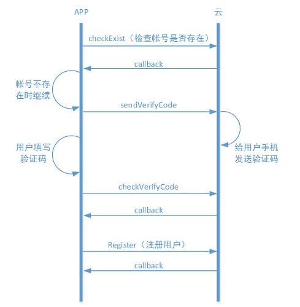
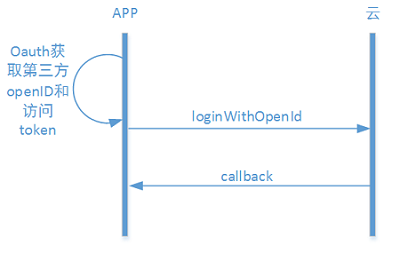
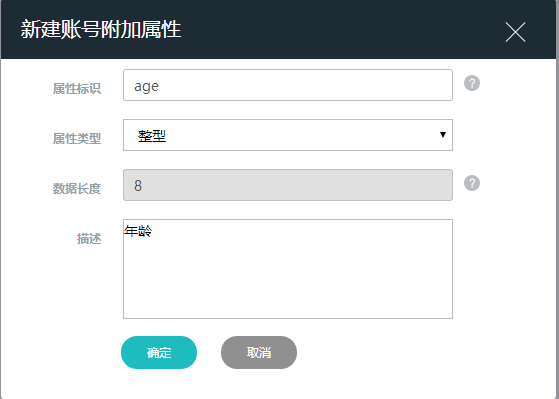

#iOS客户端和蓝牙设备
这里的蓝牙设备指的是通过蓝牙协议和手机连接进行数据同步的设备。蓝牙设备的数据需要通过手机才能上传到云端。
AbleCloud的SDK中不包括手机和蓝牙设备之间的通信协议，这部分内容由开发者自行开发设定。

#开发准备
##管理控制台
###新建产品
在控制台新建产品，填入产品名称和型号，通信方式选择蓝牙。数据格式部分，由于蓝牙设备的数据都是由安卓或者iOS客户端上报，因此建议使用JSON格式，由客户端完成蓝牙设备数据到JSON格式的转换。

安卓客户端创建之后iOS客户端不需要重复创建。

###定义产品功能点


##软件开发配置


#账号管理
##说明
蓝牙设备需要用户操作，考虑到数据同步需求，首先需要用户进行注册。AbleCloud的账号体系提供了用户注册、登录、修改密码、找回密码、发送手机验证码、第三方登录、上传用户头像、填写用户个人信息等相关的功能。

##通过APP注册为普通用户
###说明
一般国内注册需要引导用户填写手机号码，然后发送短信验证码，验证通过之后填写密码昵称等信息。为了防止频繁发送短信，一般设置倒计时1分钟（国内用户推荐使用手机注册）。

普通帐号也可以通过邮箱注册，部分地区的国外用户习惯用邮箱注册，也可以邮箱、手机号信息都写，对于仅通过邮箱注册的用户，会将验证码发送到注册邮箱；

AbleCloud建议每个APP页面只实现一个功能，该功能用户操作成功以后再跳转到下个页面。APP开发者需要将整个流程中的异常情况做合理的处理，保证用户在使用过程中所有流程都是通顺的。


###开发示例


####获取账号管理对象

```java
    ACAccountMgr accountMgr=AC.accountMgr();
```

####1、检查手机号是否已注册

```java
	AC.accountMgr().checkExist(phone, new PayloadCallback<Boolean>() {
        @Override
        public void success(Boolean isExist) {
            if (!isExist) {
                //发送验证码
            } else {
                //提示手机号已被注册 
            }
        }
        @Override
        public void error(ACException e) {
            //网络错误或其他，根据e.getErrorCode()做不同的提示或处理
        }
	});
```


####2、发送验证码

```java
    //1代表AbleCloud短信内容模板，具体开发需要先把短信模板提交到AbleCloud再获取对应的参数
	AC.accountMgr().sendVerifyCode(phone, 1, new VoidCallback() {
        @Override
        public void success() {
            //检测验证码
        }
        @Override
        public void error(ACException e) {
            //网络错误或其他，根据e.getErrorCode()做不同的提示或处理
        }
	});
```

####3、检测验证码正确性

```java
	AC.accountMgr().checkVerifyCode(phone，verifyCode, new PayloadCallback<Boolean>() {
        @Override
        public void success(Boolean result) {
            if (result) {
                //注册
            } else {
                //提示验证码错误 
            }
        }
        @Override
        public void error(ACException e) {
            //网络错误或其他，根据e.getErrorCode()做不同的提示或处理
        }
	});
```

####4、注册

```java
    //emai和phone可以任选其一;nickName为可选项，没有时传空字符串
	AC.accountMgr().register(email, phone, password, nickName, verifyCode, new PayloadCallback<ACUserInfo>() {
        @Override
        public void success(ACUserInfo userInfo) {
            //获得用户userId和nickName，由此进入主页或设备管理
        }	
        @Override
        public void error(ACException e) {
            //网络错误或其他，根据e.getErrorCode()做不同的提示或处理
        }
	});
```


##通过第三方账号登陆
###说明
为方便用户注册和登陆，可以开发第三方账号登陆功能。第三方账号授权基于Oauth协议，需要开发者先去第三方平台申请相关资质。AbleCloud提供的SDK中支持微信、微博、QQ三个第三方账号的授权登陆。


用户通过第三方登陆之后也可以再绑定普通账号。


###开发示例



```java
    //APP端在完成OAuth认证登录之后可以获取到openId和accessToken
    AC.accountMgr().loginWithOpenId(ACThirdPlatform.QQ, openId, accessToken, new PayloadCallback<ACUserInfo>() {
        @Override
        public void success(ACUserInfo userInfo) {
            //获得用户userId和nickName，进入主页或设备管理
        }   
        @Override
        public void error(ACException e) {
            //网络错误或其他，根据e.getErrorCode()做不同的提示或处理
        }
    });
    //第三方授权登陆后可以绑定一个未被注册的普通帐号；emai和phone可以任选其一;nickName为可选项，没有时传空字符串。绑定第三方账号同注册流程类似，也需要通过验证码验证用户账号。
    AC.accountMgr().bindWithAccount(email, phone, password, nickName, verifyCode, new VoidCallback() {
        @Override
        public void success() {
            //绑定账号成功
        }
        @Override
        public void error(ACException e) {
            //网络错误或其他，根据e.getErrorCode()做不同的提示或处理
        }
    });
```

##普通帐号绑定第三方账号
###说明
普通帐号在登录后，可以绑定多个第三方帐号（微信、微博、QQ等）。绑定第三方帐号成功后，可以通过第三方帐号直接登录系统，并获取此普通帐号的相关数据，比如获取设备列表信息。普通帐号绑定第三方帐号时，不允许绑定一个已经注册或者已经被绑定的第三方帐号。


###开发示例

```java
	AC.accountMgr().bindWithAccount(email, phone, password, nickName, verifyCode, new VoidCallback() {
        @Override
        public void success() {
            //绑定第三方账号成功
        }
        @Override
        public void error(ACException e) {
            //网络错误或其他，根据e.getErrorCode()做不同的提示或处理
        }
	});
```
><font color=red>注</font>：该接口需要在使用普通账户登录之后才可以调用


##帐号扩展属性
###说明
AbleCloud的基本帐号属性只包括账户名和密码以及用户昵称。如果厂商的APP中需要用户填写更多信息，如性别，年龄等，需要用到帐号扩展属性。若要使用帐号的扩展属性，首先需要在管理后台的 “帐号管理->账号附加属性” 中进行定义。如下图所示：



其中：属性标识是该属性的唯一标识，在SDK的扩展属性接口中需要作为参数。

在当前主流的设计中，为了简化用户的注册流程，帐号的扩展属性一般都是在用户完成注册以后补充填写，在帐号的注册过程中不填写。


###开发示例
####1、获取账号管理器
```java
accountMgr=AC.accountMgr();
```

####2、设置用户自定义扩展属性
```java
ACObject userProfile = new ACObject();
//注意此处put进去的key与value类型对应新建扩展属性时填写的属性标识与属性类型
userProfile.put("city"， "北京")
userProfile.put("birthday", "1989-10-13")
accountMgr.setUserProfile(userProfile, new VoidCallback() {
    @Override
    public void success() {
         //扩展属性设置成功
    }

    @Override
    public void error(ACException e) {
        //网络错误或其他，根据e.getErrorCode()做不同的提示或处理
    }
});
```

####3、获取用户自定义扩展属性
```java
accountMgr.getUserProfile(new PayloadCallback<ACObject>() {
     @Override
     public void success(ACObject object) {
         //可通过object.toString()查看扩展属性信息
         String city = object.get("city");
         String birthday= object.get("birthday");
     }

     @Override
     public void error(ACException e) {
         //网络错误或其他，根据e.getErrorCode()做不同的提示或处理
     }
});
```

如果需要存储用户的头像，请参考 文件存储

#设备管理

##说明
蓝牙设备并不一定需要和用户有确定的绑定关系。开发者可以将蓝牙设备的信息记录在用户ID上，这样用户可以任意绑定任何一个设备，然后把该设备的数据同步到该用户ID上。

对于有绑定需求的设备，AbleCloud同样提供绑定管理功能。

对于蓝牙设备，并不同WiFi设备有严格的权限限制，理论上认为，能够和蓝牙设备配对成功的即可绑定。因此AbleCloud提供的绑定功能只是对用户和该蓝牙设备的物理ID提供映射并生成一个逻辑ID。

如果蓝牙设备也需要分享，则可以使用蓝牙设备分享相关的接口。用户可以通过二维码分享自己绑定的蓝牙设备，被分享用户获得和分享用相同的设备逻辑ID，因此设备用户共享设备逻辑ID上记录的数据。

##开发示例
###不绑定蓝牙设备


###绑定蓝牙设备


###分享绑定的蓝牙设备


###取消分享


#向云端上报消息
设备可以在定时或者根据外界条件触发的情况下将设备数据和状态主动上报到云端。其中上报的消息号(message code)必须大于等于200。

？？开发针对蓝牙设备的数据上报接口。

#从云端拉去设备信息

？？开发针对蓝牙设备的从云端拉去数据的接口


#OTA
##说明
蓝牙设备OTA主要用于通过APP对蓝牙设备进行升级。
进行OTA需要以下几个步骤：
1、开发者在管理控制台发布新的OTA版本。如下图所示

？？缺少控制台的配置说明信息。

2、APP启动后或者在设备管理页面向云端检查升级。云端发布OTA后，APP会检查到有新的升级信息。
3、APP根据升级信息里的下载链接去下载OTA文件并完成校验。下载完成后通知云端OTA文件下载完成。
4、APP自己控制到设备的新的功能的安装，安装完成后APP通知云端新的版本安装完成。

流程图如下图所示：

？？缺少一个OTA的交互流程图。

##开发示例


#文件存储
##说明
文件存储是AbleCloud提供的非结构化存储功能。可以用来存储头像、文件等大的数据块。单个文件最大支持4G。


##开发示例

